## 前言

转眼间年也过完了，之前答应过海林总监说春节前写篇总结博客，虽然晚了点，但是也写写吧，正好也用流水账的形式稍微总结下 25 年都干了啥。

## 冬去春来时

2025 年 2 月，彼时的我刚结束寒假，还沉浸在 4UOnline 项目搁浅的遗憾中，久久没能振作起来。虽说大一上那会我的码风还比较青涩，但也实打实的猛写了 3000 行，还顺便重构了前辈留下的日志系统。难得有这么一个外部合作、体量大、还能赚点小钱的项目，就这么因为学校信息办的刁难和否决而搁浅，实在是让人很难接受。

好在还有寒软这么个比赛，不至于让我完全闲着。当时的阵容是毛工和我负责一前端一后端，产品大王小竺出 PRD，再带上 lyc 和 xmw 当后备组。也是用一周的时间紧赶慢赶卡着 DDL 写完了。其实当时我的预期不高，但是奈何我们队的阵容还是太强力了，稳稳拿到特等奖。

虽说寒软项目的体量比较小，但是也借着机会整了很多新东西，比如滑动验证码和 WebSocket 实时聊天（顺便写了[这篇博客](/posts/websocket-chat-server/)），还有对状态机设计的进一步熟悉，也算是小有收获。

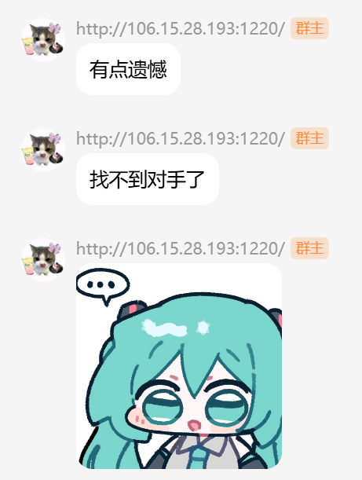

三月，冬意退得很慢，却又在某一天忽然散尽。上塘河畔的樱树一夜时间开满了花，一抹淡粉从花蕊蔓延至纯白的花瓣尖，满树粉白倒映水中。风一过，花瓣松动，零零碎碎地落下，被来往的人踩得很轻。

## 小片的阴云

到了三月末，意味着服外（大学生服务外包创新创业大赛）的 DDL 逐渐逼近，去研讨室开会的频率也大大增加。好在我们队的产品同学和前端同学都非常给力，早早的就完成了产品稿和前端页面搭建。一切看上去都稳步进行，但是这会我就开始后悔我们的选题了。

那次我们队的选题是`【A09】基于 AI 语音合成的声音处理`，一开始选这个题目还是我的注意，当时的我是这么想的：

> "语音合成能有多难做，Github 上那么多现成的开源模型，这不是随便弄吗"

事实也确实如此，我们最终使用了当时比较成熟的 CosyVoice 2 模型来做语音合成的部分。但这也意味着在模型上不好找创新点，只能在工程上多塞点东西了。

然而当时的我的水平并不能撑起这些工程的实际落地。就例如产品稿中有一项需求，是用户上传教学 PPT 然后导出 AI 讲解视频。这个需求如果要后端实际写出来主要有两大难点：

其一，PPT 的播放时间不好控制，无法做到语音讲解同步 PPT 播放（最后用了静态导出 PPT 图片的取巧方法）；其二，导出视频需要有字幕和 AI 语音对轨，难点在于需要对 AI 生成语音进行句子切分，再将字幕对轴并渲染到视频上面。

权衡时间成本和难度之后，还是选择了不做后端，而是前端直接 Mock 我们预制的素材。这就导致我在团队里的位置有点尴尬，好像大家都有活但是我又帮不上什么忙，直接变成躺赢狗了😭。最后负责了项目介绍视频的制作，但是因为我对这种视频没啥思路和经验，端出来的成品就比较平庸，处于一个能看但说不上好的水平，就这么交上去了。

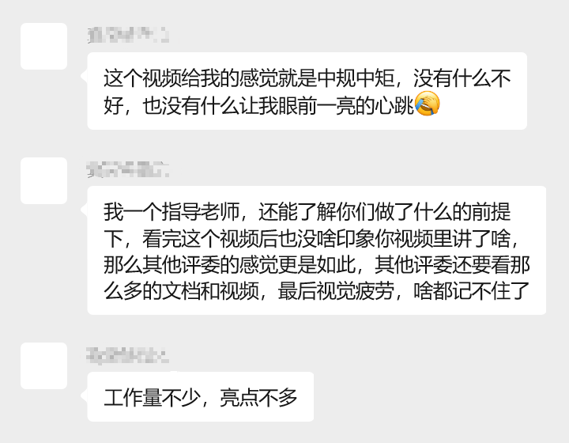

凭借着精良的文档、PPT和前端，我们最终拿到了区域三等奖，虽然没能进复赛 ~~（免费旅游）~~ 有些可惜，但是第一次参加能拿到这个结果已经超出了我的预期了。更何况当时队里每个人都差不多要燃尽了，所以就此止步感觉也不是啥坏事。

## 60 小时，在南京

大概是在四月初的一次聚餐上，我跟毛工和星晓哥约了五一假期出去玩。一开始说是一起去青岛，后来毛工和他的女朋友度蜜月去了，于是就只剩下了我和星晓哥两个单身犬。既然人数比较少，去青岛那么远的地方就显得不太划算了，于是目的地就改成了南京。

南京对我们两个穷学生来说再合适不过了。这里的消费水平跟杭州差不多，不至于像上海那样夸张；更重要的是，这座城市既有厚重的人文气息，也有舒服的生活节奏，正好配得上我们这种佛系的旅行方式。

还记得四月三十号那个下午，在把高数课托付给朋友之后，我和 hxx 一辆出租车就润到了杭州南站。等高铁的途中还顺便用一些魔法操作解决了 CTF 课的签到。杭州到南京的车程很短，虽然我们这班高铁中停站比较多，但是也只花了两个小时就到了。

出了南京南站，下到地铁，人就多起来了，毕竟是五一假期，确实是人挤人。南京的地铁样式跟广州和杭州还不太一样，看起来会更有年代感一些，并且一节车厢很长，大概是杭州地铁车厢的两倍长。另外，南京地铁在地面上的部分也会更多，相比杭州会更有城轨的感觉。

酒店就在新街口边上，建华大厦里，一晚 400 元的价格在五一假期只能订到一间无窗简陋大床房。空调是开到最大也不冷的，被子是塑料感很重的厚被子，还有每次晚上回房间都要在大厦一楼排队等半小时电梯。评价是下次出去玩还是在住宿上稍微多花点米吧。

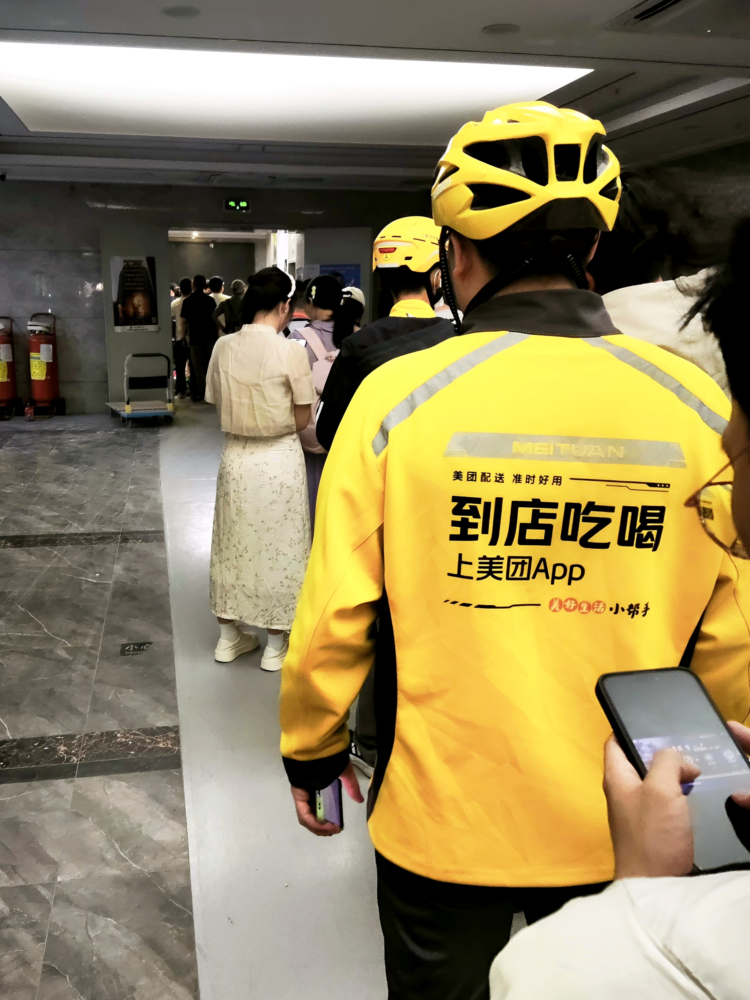

简单吃了点鸡鸣汤包填肚子后，去了夫子庙步行街散步。夫子庙商业化程度还挺重的，再叠加上人挤人的 buff，其实体验不算很好。晚上简单逛逛还是可以的，夜景挺好看，如果要买东西那就算了。可惜晚上手机拍照太糊了，怎么拍都拍不出感觉，这里就简单丢张步行街外面的图，至于秦淮河就亲自到现场去看吧。

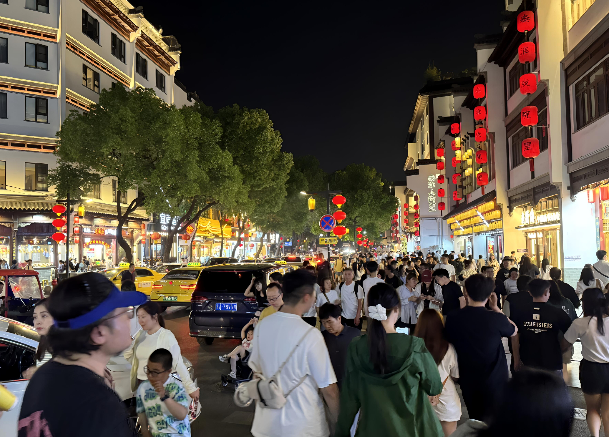

---

五月一号上午，钟山风景名胜区。由于我俩出发前一天才开始看旅游攻略，完全不知道中山陵要提前预约，所以最精华的地方就没法去了，只简单去了音乐台和明孝陵看了眼。

上午太阳挺大的，音乐台那边又热又晒又挤，鸽子刚吃了早饭窝在高处也不咋飞，感觉是白去了。所以如果你要夏天去，别听网上攻略咋说，反正我个人只建议下午去，至少太阳没那么毒，说不定还能赶上鸽子比较活跃的时候。

明孝陵没啥好说的，朱元璋和他皇后合葬的墓，去看眼打个卡就差不多了。如果你对相关历史感兴趣，爬上方城明楼之后有相关的展览和科普，可以驻足观看。

下午，侵华日军南京大屠杀遇难同胞纪念馆，可以说是去南京必去的一个地方。门口有捐款点，支付任意金额就可以拿一枝新鲜的白花。那面灰黑色的外墙和“300000”这个数字，其实在网上已经刷到过很多次，但真正站在面前的时候，心里还是一股说不出的压抑。

馆内参观的人很多，但整体秩序很好。大家都很自觉，不怎么喧哗，也没人嘻嘻哈哈拍照摆姿势。馆里内容很丰富，从历史背景、沦陷经过，到幸存者口述、实物照片，一路看下来要花两小时左右。因为馆内禁止拍照，这里就不附图了。

进馆时是阴天，灰白色的云层低低压着天空。出来时已经将近傍晚，我们二人蹲在路边等车。天空被夕阳一点点染成橘黄色，云边泛着柔软的金光。凉风从巷子尽头吹来，轻轻地揉在脸上。不远处有小贩吆喝着饮料和冰棍，几个小孩挥舞着手中的小风车，嬉闹着从我们面前跑过。

先辈们拼死守护下来的这一方天地，如今如此祥和安好。

---

二号上午，我们去了红山动物园。从初中开始好像就很少去动物园玩了，这次听闻攻略说红山动物园是 “来南京一定要去的景点” 之一，那就不得不得看看怎么个事了。入园之后就感觉这地方还是挺大的，和印象里那种一条路逛到底的动物园不太一样，这里更像一整座小山。路是上上下下的，走着走着就有种在爬景区的感觉。

动物的种类还是挺丰富的，起码我能想到的动物这里边都有，感觉如果是一个普通周末去里面逛两圈还是挺有意思的。可惜这是五一假期，为了看个老虎我得挤在人群里慢慢往前挪十多分钟，好不容易挤到玻璃窗前，却只能看见老虎妖娆的背影，你好歹转过头给我看一眼呢？

中午简单搞了顿 KFC 对付了一餐之后，下午的行程就轻松很多了，我们先去了鸡鸣寺。

鸡鸣寺在一座小山上，从山门进去要沿着台阶慢慢往上走。寺里香火很旺，空气里一直飘着淡淡的檀香味。偶尔有风从山坡那边吹过来，把屋檐下的风铃轻轻晃响。寺庙的建筑是那种很典型的江南寺院风格，黄墙黑瓦，颜色在阳光下显得格外干净。

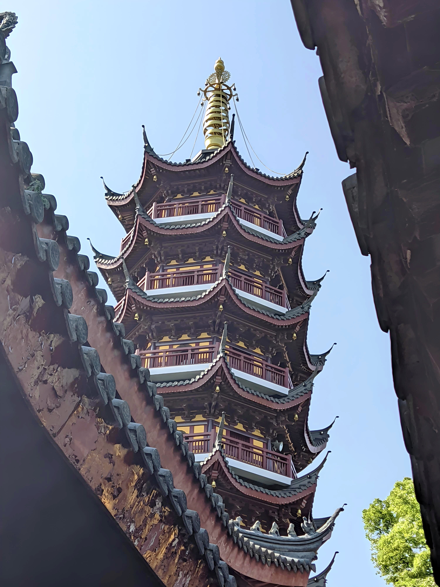

进了香之后我们就往下走，下来没多远就到了南京城墙。脚踩在厚重的城墙砖上，城墙缺口处灌进来带着湖面水汽的风。右手边支起了一长排白色的帐篷，是个临时的文创市集，卖什么的都有，让原本肃穆的城墙有了些生活感。顺着人流慢慢往前挪，一抬头，远处是标志性的紫峰大厦。脚下是六百岁的老砖，眼前是二十一世纪的摩天楼，我觉得正是这种古今交错的感觉，促成了南京独有的浪漫。

在城墙上简单绕了一遍之后，我们下到了玄武湖边。与西湖那种被群山环抱，时而雾蒙蒙的感觉不同，玄武湖明显得要清爽许多。湖边的树长得高大，风一吹便带出哗啦啦的叶子声，湖面上散布着各色的游船，远处是高楼林立的城市景观。兴许是地方够大，即使是处在五一假期，也不至于太拥挤，游玩体验比前面的景点舒服了无数倍。

我喜欢将玄武湖称作 "小西湖"，不仅因为那同样开阔的湖面，形似苏堤的台菱堤，环洲大道上那一排颇有北山街意味的梧桐树。更重要的是它们在气质上微妙的相似，不需要刻意寻找景点、只要沿着水边慢慢走就会很舒服。两片湖水各自装载着其城市的一点灵魂：杭州的温润，南京的从容。

那天下午我们就这样在湖边慢慢走着，脚步轻松，脑袋空空。难得有这么一段时间，不用考虑绩点、项目，不去操心实习、就业，只需要和身边的朋友有一句没一句地闲聊着，顺着人流往前走。走到累了，就在岸边随便找个椅子坐下，任由初夏的风一阵一阵吹过来。

眼前是被夕阳铺满金光的湖面。几只天鹅形状的游船慢悠悠地在水上晃着，船上一家人轮流踩着脚踏板，小孩趴在船边拨弄着湖水。远处的南京城区一层一层铺开，高楼的轮廓在薄薄的暮色里显得模糊。

总之，如果你要来南京，推荐你一定要去玄武湖边走走。

---

三天时间很短，从傍晚六点晚霞下的抵达，到清晨六点迎着朝阳返程，算下来刚好 60 小时。不过是一次跳脱于日常之外的出游，花园中分叉出的一条小径，短暂偏离了原本的方向，却也在不经意间，让往后的路途都沾上了一点南京的影子。

## 初入盛夏

四月份除了搞服外和准备期中考之外，还有一个比较重要的事就是开始推进精弘论坛的开发了。

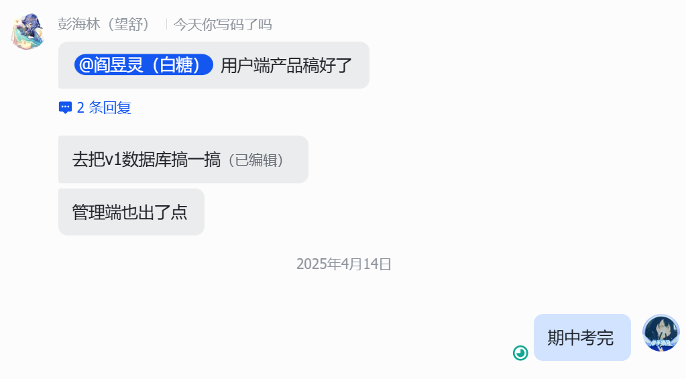

论坛作为之前精弘的明星产品，在我们内部一直有着很高的关注度。自 24 年 11 月开始推进论坛复活，到这时用户端 PRD 完工，已经过了五个月。此时的我已经急不可耐，摩拳擦掌准备开始大写特写了。

经过技术内部的讨论，我们确定了这次论坛后端改用 Java 技术栈，主体是 SpringBoot + MybatisPlus + Dubbo，采用微服务架构。

对于这个决定我是很赞成的，一方面 Golang 后端的岗位数量确实不如 Java 丰富，虽然 Go 在云原生和基础设施领域很受欢迎，但整体市场需求仍然以 Java 为主。如果能够同时掌握一套成熟的 Java 技术体系，那未来无论是找实习还是就业，都能多一种选择。

其次，引入 Java 技术栈，也能帮助我们在暑期招新时招到更多的大手子，毕竟某个知名像素风沙盒游戏就是用 Java 写的。

五一从南京回来之后，我就着手开始写数据库表，之前一直被 Gorm 的 AutoMigrate 惯着，一上来手写还有点不太适应。还好 Navicat 的设计功能很好用，我只需要在本地把表结构建好，再用 IDEA 导出 SQL 就行。

没过多久，我们敬爱的前辈派大星就把项目基础结构搭起来了，里面似乎还夹带了很多从公司里整来的风味代码。我和毛工花了大概一周时间，把 SpringBoot 从 2.x 升到了 3.x，同时顺手修了一堆奇奇怪怪的配置问题，比如 Jedis 配置不跟随 Spring、Dubbo 连不上配置中心之类的。

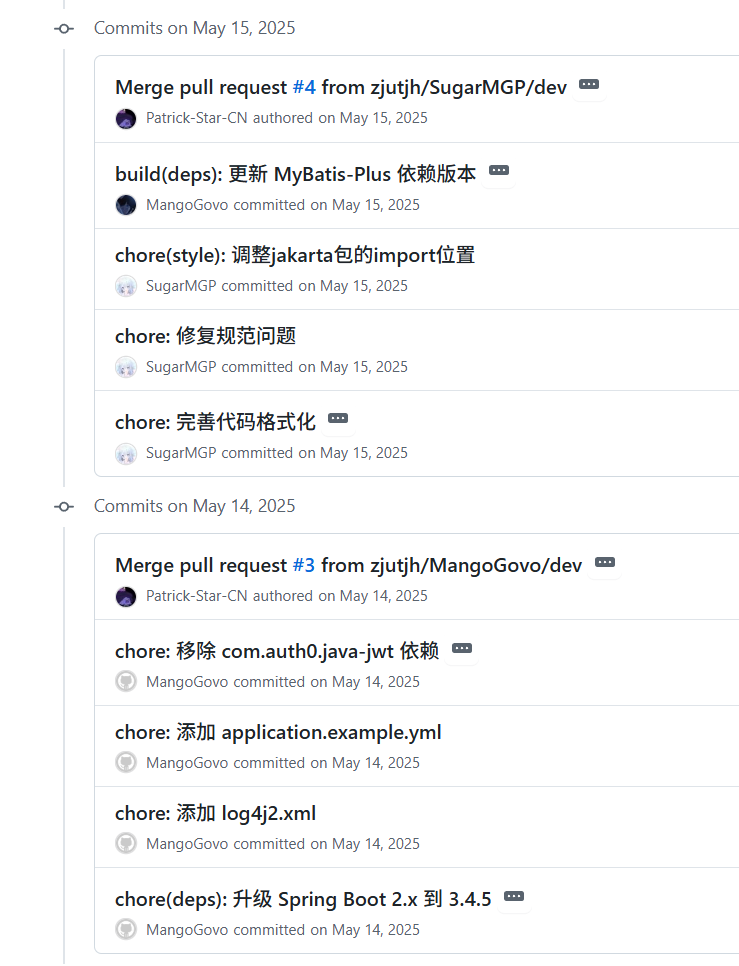

因为是第一次接触微服务，大概花了两个星期的时间才完整吃透这个框架。另外我也逐渐意识到，原先使用的 protobuf 模式并不适合该项目，因为没有外部服务需要调用论坛，本身也不需要对外暴露 API，并且当时 Dubbo 的 protobuf 编译还有点问题，`google.protobuf.Empty` 不会被正常编译为 `Null`，而是直接在代码中产生一块空白。

后来我们干脆改用了 Dubbo 自带的 Java Interface 模式。虽然牺牲了跨语言调用的能力，但换来了更好的代码可读性，也降低了开发时的心智负担，对于部门转型初期来说反而更加合适。

初入盛夏，心情也随之变得焦躁和兴奋，一边期待着论坛最终上线的那一天，期待着小幼苗长成参天大树的那一天；一边焦虑着即将到来的期末考，即将发生的部长团选举。

前任部长们该实习的实习，该考研的考研，都得为各自的生活奔波，也到了我们这届小登接过大旗的时候了。实话说，当了一年黑奴部员，也就是凭着一腔热血写码，对部门管理这类的事情完全没有了解，转眼间就轮到要我们带小登了，心里还是挺慌的。

部长团面试那天，淅淅沥沥地下着毛毛雨，哥几个在准备室里紧张地讨论着面试问题，等待一个接一个被叫进去。看得出海林很是器重我和毛工，给我们留到了最后的压轴位置。其他人面十五分钟，到我们这就变成三十分钟压力面了。最终也是被狠狠拷打了一遍，派问的 MySQL 索引和 MVCC 倒还算阳间，青鸟问的真是阴的没边了，上来就问 Linux 内核和网络原理，一题也没答出来。还有 byd 彭海林啥也不问就纯盯着我笑，能绷得住的都是神人了。

本来打算简简单单当个副部划划水摸摸鱼，毕竟我也不是什么能抗压的人，结果直接给我干成部长了，那只能硬吃压力了。

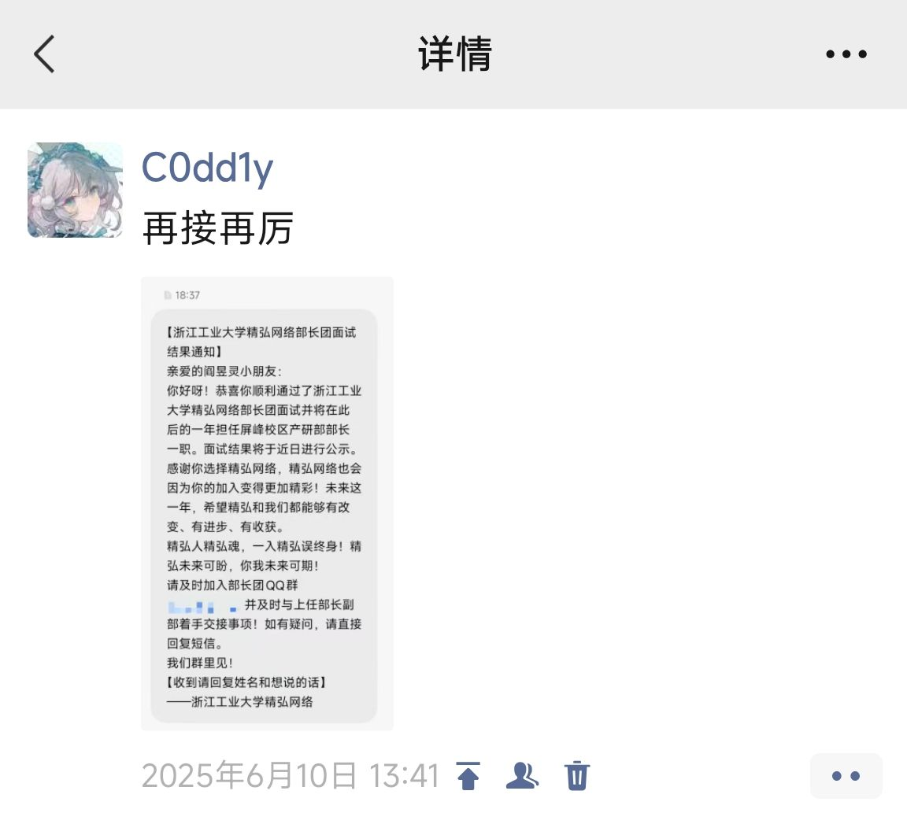

经过期末周酣畅淋漓地一顿自学，期末考也是艰难地通过了。专业课自不必说，都是宝宝巴士级别的，没考到 85+ 算炸单。最让我难受的还得是学术英语和大物，好歹也过了一整年了，高中老本都忘的差不多了，再加上本来我就不爱写议论文，拿英文写就更不会了，期末弄个 70 多我已经很满意了。

大物是最痛的，期末周给大物足足留了三天准备时间，课也听了题也刷了，可以说是给足尊重了，一上考场还是被击碎了，55 分耻辱下播。本来大物有 60 分斩杀线，考完之后老师说因为这次太难了，把斩杀线下调到 50 分，侥幸活下来了。

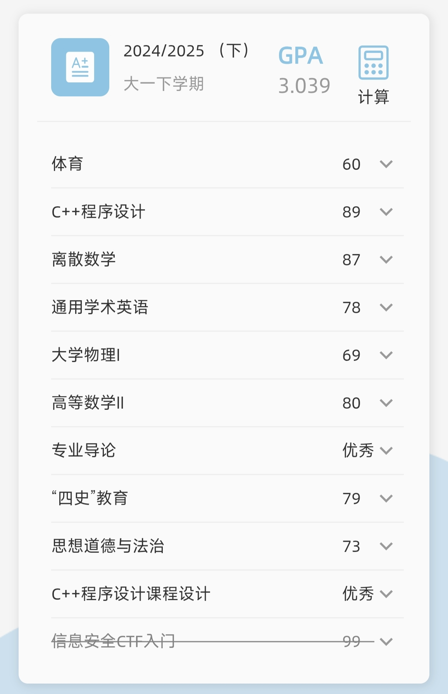

说来还有点可惜，大一这一学年绩点排名在年级 30% 多，离省政府奖学金其实也就差一点点，主要是之前没想过我综测排名原来这么高，能到年级前 9%。要是当时高数大物再蒸一蒸，说不定还真就拿着了，可惜确实蒸不了一点。小小遗憾，大二我自会弥补上。

期末考完马不停蹄就开始军训了。往年的军训都是七月考完先搬到屏峰再训，25 届开始就是入学时在朝晖训，只有我们 24 届夹在中间，七月考完在朝晖训。为期两周的军训，早上六点起来先训上三个小时，十点多去上军事理论，中午吃个饭睡两小时起来参加杂七杂八的活动，晚上吃完饭还有一个小时晚训，回到宿舍写写军训日记交上去，捣鼓捣鼓论坛代码，就十二点了。

第一周是真难熬，本身之前已经习惯十二点后睡，中午或者下午才起的悠闲生活了，一下子让我早上六点起床比杀了我还难受。军训倒也没啥内容，就是在太阳下猛猛罚站，顶多齐步走练习下。第二周就好起来了，因为没参加会操，我们几个从原队伍里剥离出来的小队就托管给了隔壁排的教官，这教官人挺好，每天让我们稍微训训，之后就找个阴地方把我们拉过去摸鱼了。

## 

好不容易熬完军训，总算迎来了暑假。又久违地回到了广东，见了见高中宿舍的好哥们，除此之外也没啥别的活动了。三十多度的艳阳天，当然是窝在家吹空调更惬意。

放假归放假，该干的活还是少不了的。论坛这边迎来了快速迭代期，产品、UI、前后端全线发力，基本隔几天就得开一次会，好在大家的沟通协作效率还是挺高的，基本大部分问题都能很快达成一致并落实对接。

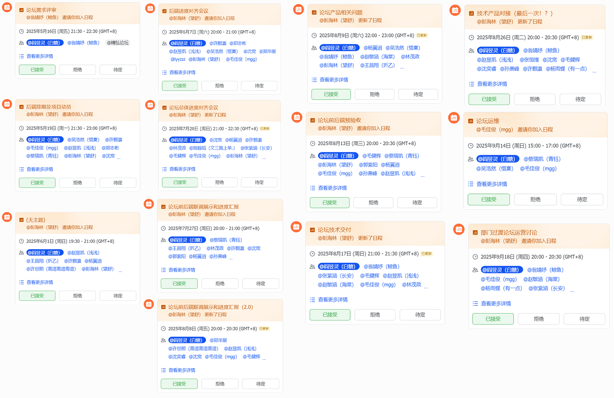

具体开发过程也不细讲了，总之大家都很积极参与，同时作为后端这块的主要负责人，也是洋洋洒洒贡献了一万三千行代码。在那个 vibe coding 还没完全普及的时期，能通过古法编程造出这么多代码，想想还是挺神奇的。

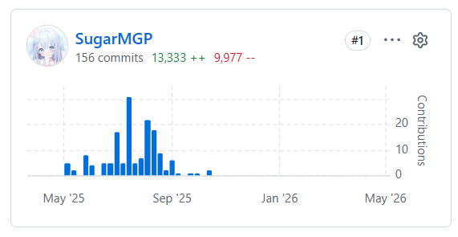

论坛之外主要就是忙招新了，既然论坛已经用了 Java 技术栈，那今年的后端微课自然就该教 Java 后端。
