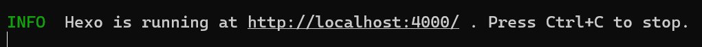
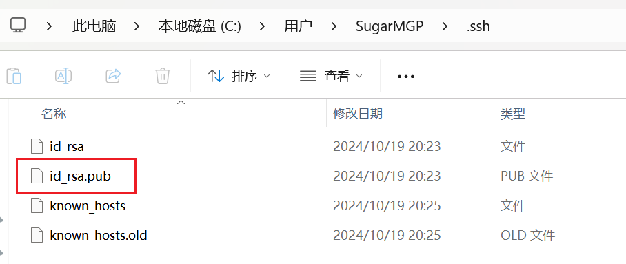
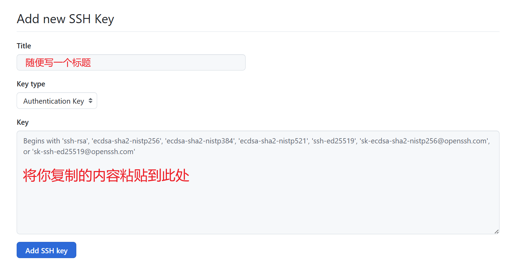
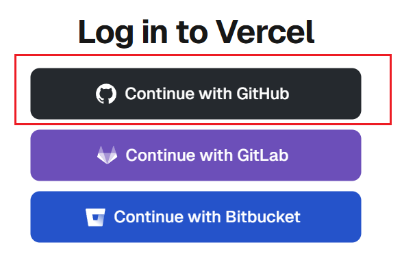
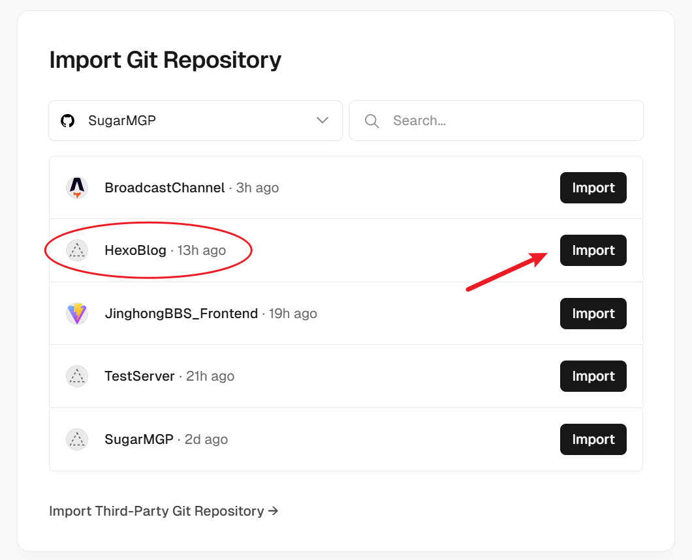
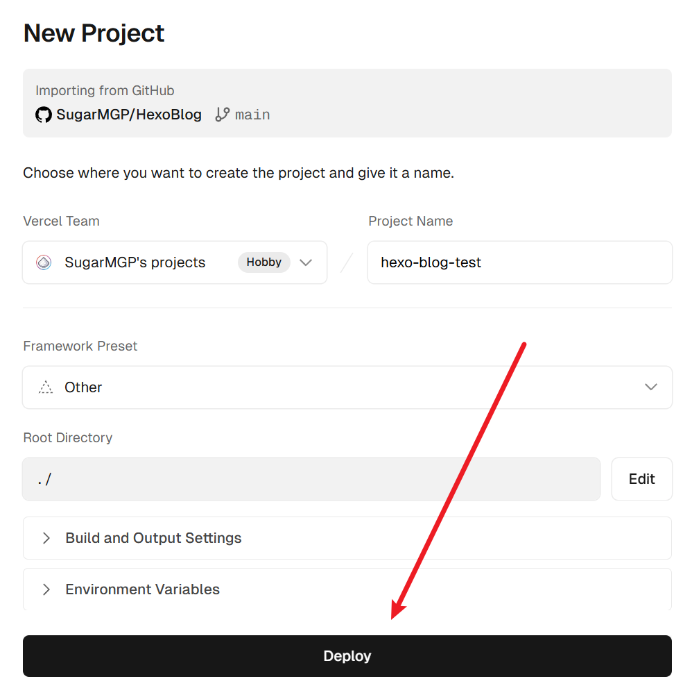
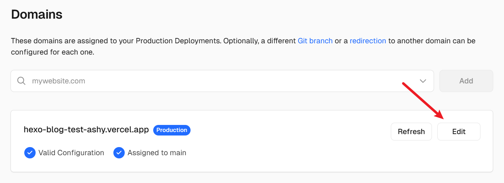
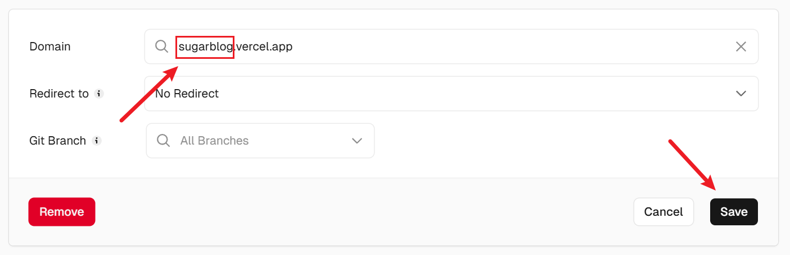
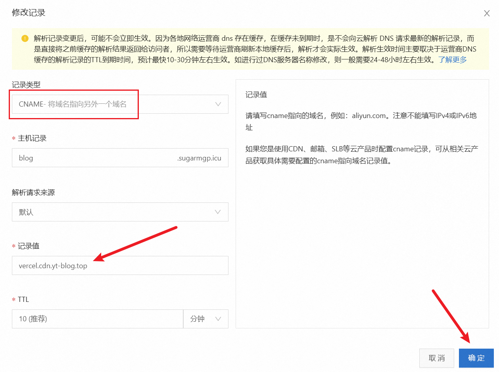
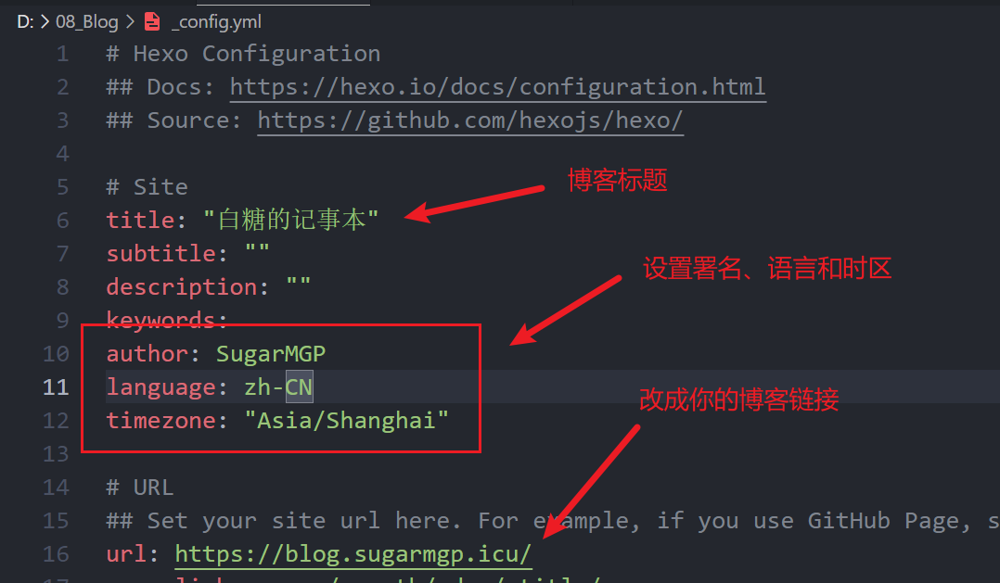

## 前言

**Hexo** 是一个快速、简洁且高效的博客框架，可以通过 Markdown（或其他渲染引擎）解析文章并生成静态网页。

**Vercel** 是一家基于云的开发平台，提供免费的静态网站托管服务。

本文将介绍如何**通过 Vercel 部署 Hexo 博客**。

## 准备工作

安装 [Node.js](https://nodejs.org/zh-cn) 和 [Git](https://git-scm.com/downloads)，修改 NPM 为淘宝镜像源（可选）.

```bash
# 修改 NPM 为淘宝镜像源
npm config set registry https://registry.npmmirror.com
```

然后登录你的 Github 账号并创建一个新的公开仓库。

打开终端，输入以下两行代码来配置你的 Git：

```bash
git config --global user.name "此处填写你的Github用户名"
git config --global user.email "此处填写你的Github绑定的邮箱"
```

## 安装 Hexo

新建一个文件夹作为你的博客文件的存放位置，点进去打开终端输入以下命令：

```bash
# 安装 Hexo
npm install -g hexo-cli

# 安装部署插件
npm install hexo-deployer-git --save

# 初始化 Hexo 博客
hexo init

# 安装博客所需要的依赖文件
npm install
```

等待运行完成，输入以下命令：

```bash
hexo g
hexo s
```

如果配置正确则会得到以下提示：



打开浏览器访问 `http://localhost:4000` 即可看到你的 Hexo 博客页面，说明博客在本地运行成功。

## 上传到 Github

我们已经完成了 Hexo 的本地运行，接下来我们将本地博客上传到 Github 仓库进行托管。

首先打开终端，输入以下命令生成 SSH 密钥：

```bash
# 输入后一直回车即可
ssh-keygen -t rsa -C "Github绑定的邮箱地址"
```

打开 `%USERPROFILE%/.ssh` 文件夹，找到 `id_rsa.pub` 文件。



打开这个文件并复制里面的内容，

然后打开 Github 的 [SSH Keys 设置页](https://github.com/settings/keys)，点击 `New SSH Key` 按钮，将刚才复制的内容粘贴到 `Key`，并随便输入一个标题。



回到终端输入`ssh -T git@github.com`，输入yes，出现`You’ve successfully …`的字样说明连接成功。

进入博客站点目录，打开`_config.yml`文件，找到`deploy`部分，修改成以下内容：

```yaml
deploy:
  type: git
  repo: git@github.com:<Github用户名>/<仓库名>.git
  branch: main
```

在博客站点目录下打开终端，输入`hexo g -d`，即可自动生成静态网页并上传到 Github 仓库。

## 部署到 Vercel

用 Github 账号登录 [Vercel](https://vercel.com/).



点击 `Add New Project` 按钮，选择刚才上传的 Github 仓库并点击 `Import`，点击 `Deploy` 按钮，等待部署完成。




打开新建的 Project，点击 `Visit` 按钮，即可看到你的 Hexo 博客页面。

## 域名设置

打开 Project Settings，点击 `Domains` 按钮，进入域名设置页面。

Vercel 给你默认分配了一个域名，你可以点击 `Edit` 按钮修改它：





如果需要绑定自己的域名，你可以输入自己的域名并点击 `Add` 按钮，

并打开域名服务商的 DNS 管理页面，将域名的 CNAME 记录指向 `vercel.cdn.yt-blog.top`（一个公益 Vercel CDN）.



等待 DNS 解析生效，然后打开浏览器访问你的域名，即可看到你的 Hexo 博客页面。

## 博客配置

博客的配置文件位于博客站点目录下的 `_config.yml` 文件，你可以根据自己的需求修改以下内容：



更多高级设置请参考 [Hexo 官方文档](https://hexo.io/zh-cn/docs/)。
