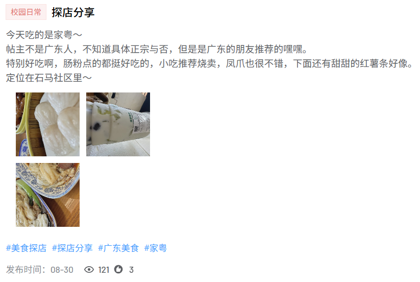
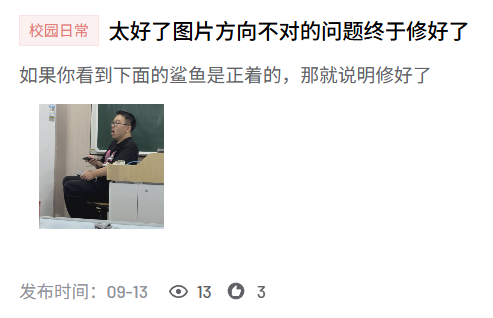

## 前言

**精弘存储立方**（简称 Cube）是我们内部自研的对象存储中间件，支持对**传统文件系统**和 **AWS S3** 进行连接和操作，为我们其他项目提供了高效统一的对象存储服务。在此之外，我们也根据实际业务需求提供了许多**针对图片的特殊功能**，例如 Webp 转码存储和缩略图功能等。

然而在开发这些图片功能的过程中，踩过的坑真是数不胜数，正好写两篇博客分享一下这些有趣的问题和最终的解决方法。

## 发现问题

在测试项目上线后，一位用户在发布广东美食相关的帖子时，所**显示的图片方向与预期不符**，用户需要旋转自己的脖子才能看到正确的图像。



在经过一轮测试后，我们发现这个问题只会出现在**苹果设备**拍摄的照片上，而在其他设备上则没有问题。于是我们把这种现象形象地称为 ~~"苹果螺旋现象"~~。

一开始我只以为是 iOS 相机拍摄时的方向策略有问题，所以并没有太放在心上，毕竟图片上传的逻辑就是将文件原样上传到项目服务端，然后送到 Cube 进行转码存储，不应该会在这上面出问题。

直到技术面试那天我和毛衣闲聊时，偶然提到**图片元数据**这个点，才想起问题出在哪：

iOS 相机拍照后会把图像朝向信息存储在 **EXIF 元数据**中，而 Golang 官方的 `image` 库进行解码时**只会读取像素信息**，并不会根据元数据进行相应的方向旋转处理。

## 尝试保留元数据

发现问题后，我脑袋中立刻想到的第一个解决方法就是在编码图片时**保留 EXIF 元数据**。

然而经过一番尝试后，我发现这条路行不通。

首先，我们在 Cube 中使用 `github.com/chai2010/webp` 库进行 Webp 编码，而这个库只对 `libwebp` 的基础编码接口进行了 Golang 封装，**并没有暴露 EXIF 的写入接口**，这意味着我们只能自己提取元数据，然后**手动封装**成 `EXIF chunk` 并插入到 `RIFF` 容器中。

其次，保留元数据也不利于后续的图像处理，例如在对图片进行缩略图生成时，又要**重新进行一遍上述操作**，来把元数据封装到 JPEG 缩略图中。

所以最终我还是选择了另一个简单粗暴的方案：直接在上传图片时就对图片进行**方向修正**，然后再进行编码。

## 方向修正

方向修正的实现也比较简单，先**读取 EXIF 元数据**，然后根据 `Orientation` 标签的值对图像**进行旋转处理**即可。

读取元数据可以用 `github.com/rwcarlsen/goexif/exif` 这个库，将文件读取为 `io.Reader` 后传入解码器即可。

```go
x, err := exif.Decode(exifData)
if err != nil {
	return nil, err
}

// 读取 Orientation 标签的值
tag, err := x.Get(exif.Orientation)
if err != nil {
	return nil, err
}

// 转换为整数
orientation, err := tag.Int(0)
if err != nil {
	return nil, err
}
```

旋转图片的操作可以用 Golang 官方的 `image` 库进行，不过需要手动映射像素，比较麻烦。

我们可以使用 `github.com/disintegration/imaging` 这个库，它封装了 `FlipH`、`FlipV`、`Rotate180` 等**常用的旋转操作**。

以下是根据不同 `Orientation` 值进行旋转的代码：

```go
// applyOrientation 根据 EXIF Orientation 调整图像方向
func applyOrientation(img image.Image, orientation int) image.Image {
	switch orientation {
	case 1: // 正常
		return img
	case 2: // 水平翻转
		return imaging.FlipH(img)
	case 3: // 旋转 180°
		return imaging.Rotate180(img)
	case 4: // 垂直翻转
		return imaging.FlipV(img)
	case 5: // 顺时针 90° + 水平翻转
		return imaging.FlipH(imaging.Rotate270(img))
	case 6: // 顺时针 90°
		return imaging.Rotate270(img)
	case 7: // 顺时针 90° + 垂直翻转
		return imaging.FlipV(imaging.Rotate270(img))
	case 8: // 逆时针 90°
		return imaging.Rotate90(img)
	default:
		return img
	}
}
```

最后在执行 `webp.Encode` 函数前调用 `applyOrientation` 函数即可。

## 坐现成的轮椅

既然已经引入了 `imaging` 这个库，那它还能帮我们简化更多操作吗？

当然可以，其实 `imaging` 库内置的解码函数已经提供了**自动处理方向**的选项，可以直接替换掉 `image` 库的解码函数。

```go
// Before
img, _, err := image.Decode(reader)
if err != nil {
	return nil, err
}
// 此处省略 20 行读取 orientation 的代码
img = applyOrientation(img, orientation)

// After
img, err := imaging.Decode(reader, imaging.AutoOrientation(true))
if err != nil {
	return nil, err
}
```

此外，缩略图的**自动缩放逻辑**也能直接用现成的 `imaging.Fit` 替代。

```go
// Before
func resizeIfNeeded(img image.Image, targetLongSide int) image.Image {
	b := img.Bounds()
	w, h := b.Dx(), b.Dy()
	longSide, shortSide := max(w, h), min(w, h)

	if longSide <= targetLongSide {
		return img
	}
	scale := float64(targetLongSide) / float64(longSide)
	targetShort := int(float64(shortSide) * scale)

	var tw, th int
	if w > h {
		tw, th = targetLongSide, targetShort
	} else {
		tw, th = targetShort, targetLongSide
	}

	dst := image.NewRGBA(image.Rect(0, 0, tw, th))
	draw.Lanczos.Scale(dst, dst.Rect, img, b, draw.Over, nil)
	return dst
}

// After
func resizeIfNeeded(img image.Image, targetLongSide int) image.Image {
	return imaging.Fit(img, targetLongSide, targetLongSide, imaging.Lanczos)
}
```

由此可见，`image` 库自带的处理函数功能较为精简，只提供了**最基础的操作和绘图函数**，而 `imaging` 库则提供了**完善的封装**和**更多高级功能**，简直是超级轮椅般的存在。

## 问题解决

将修复后的版本上线到生产环境后，iPhone 用户拍的照片方向终于恢复正常了。


