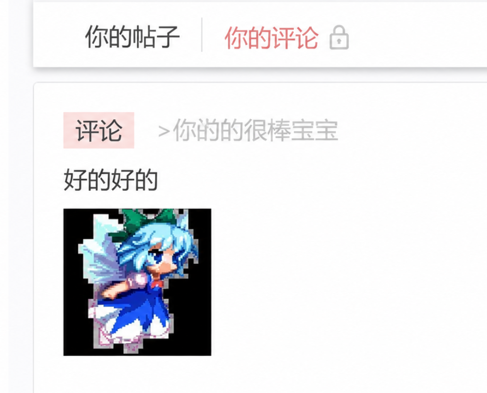

## 前言

好久不见，本来写完[上一篇](/posts/cube-1st/)后就想尽快把这篇的坑填上，结果因为各种琐事一拖再拖，后来因为时间久远，思路忘了大半，再加上想到要重新找素材和资料，一度想要放弃。终于在 GPT 5.6 的帮助下，把复现过程和当时的案例重新翻了出来，才有了这篇文章。

这篇虽然是第二篇，但事情其实发生得更早，要从 2025 年 8 月刚做缩略图时说起。当时 Cube 已经会把上传的图片统一转成 WebP 格式存储。由于测试服带宽有限，如果论坛加载列表时每次都拉一张几兆的原图，会极大降低用户体验。我便在 Cube 里加了缩略图功能，逻辑很简单：从对象存储拿到原文件，解码，把长边缩到 640 像素以内，再编码成 JPEG 写进缓存文件夹。

```go
img, _, err := image.Decode(object)
if err != nil {
	return nil, 0, err
}

finalImg := resizeIfNeeded(img, config.Config.GetInt("oss.thumbnailLongEdge"))
err = jpeg.Encode(buf, finalImg, &jpeg.Options{
	Quality: config.Config.GetInt("oss.thumbnailQuality"),
})
```

普通照片都没问题，但是带透明背景的图片编码成 JPEG 后，透明部分会变成黑色。



这是因为 JPEG 本来就不支持 Alpha 通道，为了去除透明度信息，主流编码库会把透明部分和黑底混合。但是黑底的缩略图放在论坛的白色界面里格外的突兀，所以需要先给图片加一层白底，再编码成 JPEG。

真正离谱的东西，是从加白底之后才冒出来的。

## 白底一铺，图片花了

给透明图片加白底，本来应该是很平常的两次绘制。先用 `draw.Src` 把纯白色复制到目标图，再用 `draw.Over` 按透明度盖上原图：

```go
b := img.Bounds()
out := image.NewRGBA(b)

draw.Draw(out, b, &image.Uniform{C: color.White}, image.Point{}, draw.Src)
draw.Draw(out, b, img, b.Min, draw.Over)
```

但代码跑完，原来透明的区域没有变成白色，反而炸出了一圈青色、紫色、绿色的噪点，像显存坏了以后截出来的花屏。


直觉告诉我是 `draw` 库本身的行为有问题。源 WebP 在浏览器里看着正常，直接编码 JPEG 也只是黑底，偏偏执行完 `draw.Draw` 才花，怎么看都像绘图库在处理透明像素时算错了。

## 手搓一个 Draw

既然库算不对，我先绕过库自己算。

我写了一个 `removeAlpha`。它挨个读取图片像素，把 RGB 三个通道按 Alpha 混到白色上，最后强制把透明度设为 255：

```go
func removeAlpha(img image.Image) *image.RGBA {
	b := img.Bounds()
	out := image.NewRGBA(b)

	for y := b.Min.Y; y < b.Max.Y; y++ {
		for x := b.Min.X; x < b.Max.X; x++ {
			r, g, b_, a := img.At(x, y).RGBA()

			r8 := uint8(r >> 8)
			g8 := uint8(g >> 8)
			b8 := uint8(b_ >> 8)
			a8 := uint8(a >> 8)

			i := (y-b.Min.Y)*out.Stride + (x-b.Min.X)*4
			out.Pix[i+0] = uint8((int(r8)*int(a8) + 255*(255-int(a8))) / 255)
			out.Pix[i+1] = uint8((int(g8)*int(a8) + 255*(255-int(a8))) / 255)
			out.Pix[i+2] = uint8((int(b8)*int(a8) + 255*(255-int(a8))) / 255)
			out.Pix[i+3] = 255
		}
	}
	return out
}
```

把它放到缩放前面，彩色乱码消失，白底也正常了。


这就是第一版修复方案，非常简单粗暴，可代码提交以后，我越看越觉得不对。

手动把 RGB 再乘一次 Alpha 之后，彩色乱码消失了，生成的缩略图也恢复了正常。如果这一步真的是必要的，为什么 `draw` 库没有处理？如果它本来不该做，又为什么偏偏能把图片修好？

花屏虽然没了，这几个问题却还杵在那里。

## 寻求帮助

盯着一整张图不好查，于是我写了个 2×2 的最小示例，只保留一个完全透明、RGB 又不为零的像素：

```go
src := image.NewRGBA(image.Rect(0, 0, 2, 2))
src.SetRGBA(0, 0, color.RGBA{R: 100, G: 150, B: 200, A: 0})

dst := image.NewRGBA(src.Bounds())
draw.Draw(dst, dst.Bounds(), &image.Uniform{C: color.White}, image.Point{}, draw.Src)
draw.Draw(dst, dst.Bounds(), src, image.Point{}, draw.Over)

r, g, b, a := dst.At(0, 0).RGBA()
fmt.Printf("%d %d %d %d\n", r>>8, g>>8, b>>8, a>>8)
// 100 150 200 255
```

透明像素盖到白底上，输出的却不是白色。我把这个现象发到了 [golang-nuts](https://groups.google.com/g/golang-nuts/c/7JAsfXb7N-U/m/5-7fnjXWBwAJ) 寻求解答。

在经过几轮交流后，社区大佬 Kevin Chowski 的回复点醒了我。他引用了 `color.RGBA` 的约束：

> 预乘透明度后的颜色分量必须满足 `0 <= C <= A`。因此 `color.RGBA{R: 100, G: 150, B: 200, A: 0}` 是非法值。

我这才意识到，自己从一开始就把两种颜色表示混在了一起。

## RGBA 和 NRGBA，差的不止一个字母

Go 里的 `color.RGBA` 使用 **Alpha 预乘**。所谓预乘，就是 R、G、B 在存进去之前已经乘过透明度。一个半透明的红色像素，不会继续保存满值的红色；Alpha 越小，RGB 也要跟着缩小。

所以 RGBA 的每个颜色分量都不能大于 Alpha。`A=0` 代表完全透明，此时 R、G、B 也必须全部为零。

`color.NRGBA` 的 N 表示 Non-premultiplied，即"未预乘"。它允许完全透明的像素继续保留原来的 RGB，调用 `RGBA()` 时再临时完成预乘。PNG 和 WebP 里的透明像素保留隐藏颜色，本身不奇怪；奇怪的是把这种未预乘数据装进 `image.RGBA`。

`draw.Over` 信任了这个类型。它看到 Alpha 是 0，就认为 RGB 也已经缩成 0，不会再替源像素乘一次。可实际传进来的 RGB 仍然有值，于是这些本应藏在透明区域里的颜色被直接叠到白底上，最后就成了那圈彩色乱码。

手写 `removeAlpha` 为什么有效，也终于说得通了。它又拿 RGB 乘了一次 Alpha，刚好补上了解码数据缺失的预乘。只是这种写法只对这种不合法的错误数据有效；换成合法的 `image.RGBA`，它反而会多乘一次，把半透明颜色算暗。

我原本以为自己修了 `draw` 的边界情况，实际只是拿一段同样不严谨的代码，碰巧抵消了上游的另一个错误。

## 查回上游解码器

Kevin 的回复把问题从绘制阶段推回了解码阶段。我重新打开那张 WebP，先不做缩放，也不画白底，只打印 `image.Decode` 返回的具体类型，再找 `A=0`、RGB 非零的像素。

```go
img, _, err := image.Decode(file)
if err != nil {
	return err
}

fmt.Printf("decoded type: %T\n", img)

bounds := img.Bounds()
for y := bounds.Min.Y; y < bounds.Max.Y; y++ {
	for x := bounds.Min.X; x < bounds.Max.X; x++ {
		r, g, b, a := img.At(x, y).RGBA()
		if a == 0 && (r != 0 || g != 0 || b != 0) {
			fmt.Printf("Pixel(%d,%d): R=%d G=%d B=%d A=%d\n",
				x, y, r>>8, g>>8, b>>8, a>>8)
		}
	}
}
```

```text
decoded type: *image.RGBA
Pixel(176,0): R=0 G=1 B=0 A=0
Pixel(192,0): R=108 G=109 B=104 A=0
Pixel(193,0): R=110 G=108 B=104 A=0
```

果然，输出的内容完全符合我得出的结论，返回值明确是 `*image.RGBA`，里面却装着 RGB 值大于 Alpha 的像素。

我继续顺着 `image.Decode` 查，发现 Cube 当时同时带了两个 WebP 解码器：

```go
import (
	"github.com/chai2010/webp"
	_ "golang.org/x/image/webp"
)
```

`github.com/chai2010/webp` 是 Cube 用来编码 WebP 的第三方库，`golang.org/x/image/webp` 则是 Go 官方扩展仓库里的解码器。后者用空白导入，目的很明确，只调用包内的 `init()` 初始化函数，把 WebP 格式注册给 `image.Decode`。

没想到 `chai2010/webp` 也会偷偷做同一件事。它的 `reader.go` 末尾同样有一个自动注册：

```go
func init() {
	image.RegisterFormat("webp", "RIFF????WEBPVP8", Decode, DecodeConfig)
}
```

两个包注册了相同的 Magic Number。`image.RegisterFormat` 会把解码器按注册顺序保存，`image.Decode` 从头查找，遇到第一个匹配项就直接使用。在 Cube 使用的 import 格式化规则中，`chai2010/webp` 排在前面，官方解码器虽然也导入了，实际上根本轮不到它。

再继续深入 `chai2010/webp` 的源码，问题就很直白了。它调用 `libwebp` 解出未预乘的 RGBA 字节，随后直接拿这块内存构造 `image.RGBA`：

```go
func DecodeRGBA(data []byte) (m *image.RGBA, err error) {
	pix, w, h, err := webpDecodeRGBA(data)
	if err != nil {
		return nil, err
	}
	m = &image.RGBA{
		Pix:    pix,
		Stride: 4 * w,
		Rect:   image.Rect(0, 0, w, h),
	}
	return m, nil
}
```

字节本身没有坏，错的是外面套的类型。它们应该按未预乘颜色解释，解码库却把它们标成了已经预乘的 `image.RGBA`。

到这里，终于可以盖棺定论了。

## 让官方解码器接手

定位到解码器以后，我把问题和复现过程整理成了 [Issue](https://github.com/chai2010/webp/issues/81)，本来还想着等作者从上游把问题修掉。没过多久再点进仓库，仓库简介里已经多了一句："该项目不再维护，大家自己 fork 吧"，Issue 也一直没有后续。

既然等不到上游修复，就只能自己动手了。

Cube 仍然要用 `chai2010/webp` 编码，不能直接删掉依赖。我最后 fork 了一份库，移除 `init()` 里的自动解码器注册，再在 `go.mod` 中用 `replace` 语法指向修正版本：

```go
replace github.com/chai2010/webp => github.com/SugarMGP/webp v1.4.1
```

（注：该 fork 仓库现在已经不存在了，Cube 已经换用了其他 Webp 编码库）

这样 `chai2010/webp` 就只负责编码功能，`image.Decode` 遇到 WebP 时会走官方解码库。

改用官方解码器后，返回类型变成了带独立透明通道的亮度-色度图像 `*image.NYCbCrA`。这一次再交给 `draw.Over` 铺白底，那圈彩色乱码消失了。


## 后记

经过这次 Debug 经历，我对 Go 的图像类型有了更深的理解。同时我也明白了一个道理：不要盲目信任你的上游依赖，即使它的 Star 数很多，用的人很多，其中也有可能隐藏着致命的问题。