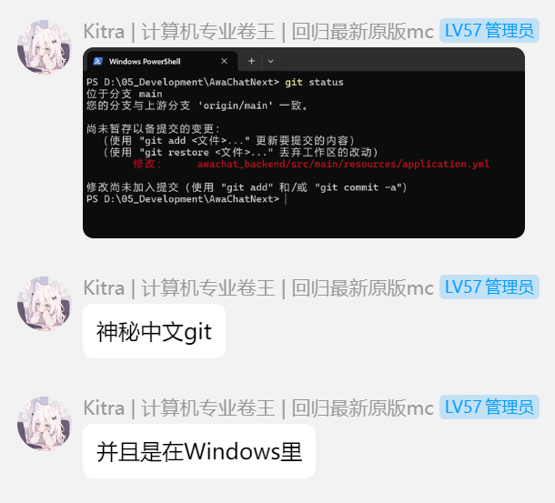
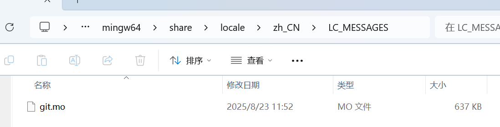
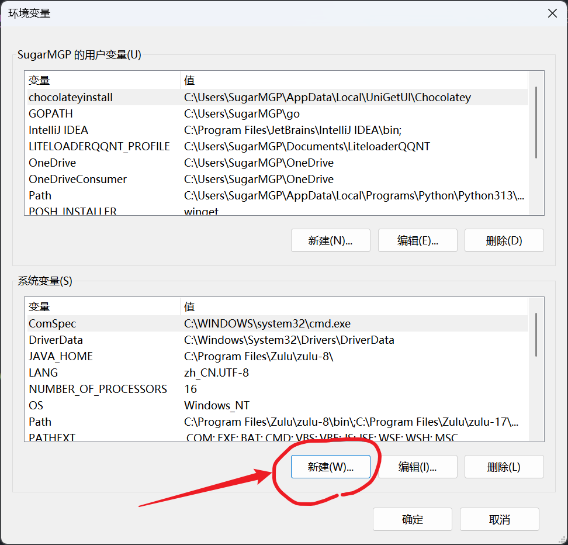
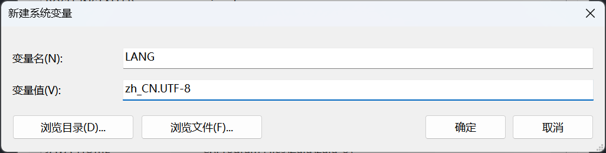
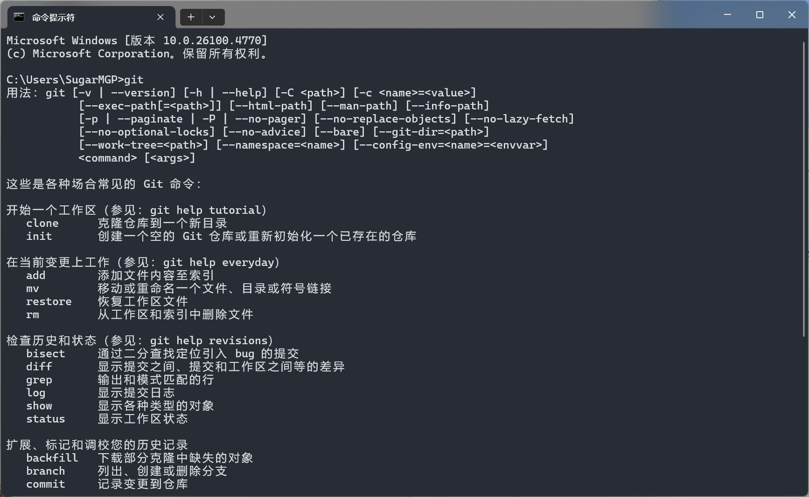

## 前言

今天水群的时候，看到一群友在 Windows 下吃上了中文 Git



与其讨论后得知 Git 官方提供了中文语言包，但是 **Git for Windows 并没有打包国际化文件**，导致在 Windows 下使用 Git 时默认只能使用英文

于是心血来潮，写篇博客记录下如何在 Windows 下应用 Git 官方汉化

## 构建翻译文件

打开 [Git 官方仓库](https://github.com/git/git)，找到 `po` 目录，可以看到里面有各个语言的翻译文件

`.po` 文件是 **Portable Object 文件**，主要用于软件国际化（i18n）和本地化（l10n），它是 GNU gettext 使用的标准格式

要将 `.po` 文件转换为软件能读取的 `.mo` 文件，需要使用 `msgfmt` 命令进行构建

为了方便大家使用，我已经创建了一个[构建仓库](https://github.com/SugarMGP/git-l10n-build)，每天早上 8 点 Github Action 会自动从上游获取 Git 最新语言文件，如果有更新则自动构建出 `.mo` 文件并上传到 Release

当然，如果您有 Linux 环境，也可以通过下面的命令来手动构建

```bash
# 安装 gettext 工具
sudo apt-get update && sudo apt-get install -y gettext

# 构建 zh_CN.mo 文件
msgfmt zh_CN.po -o zh_CN.mo
```

## 应用翻译文件

获取构建好的 `zh_CN.mo` 文件后，将文件名改为 `git.mo`

打开 `C:\Program Files\Git\mingw64\share\locale\zh_CN\LC_MESSAGES`，其中 `C:\Program Files\Git` 是你的 Git 安装目录

如果子目录不存在，则需要手动创建文件夹来补全

然后将 `git.mo` 文件复制到该目录下



最后，新建环境变量 `LANG=zh_CN.UTF-8`





## 效果

重新打开你的终端，输入 `git` 命令，享受中文！


