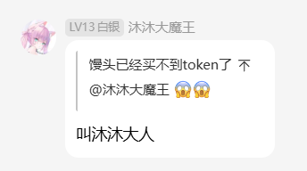
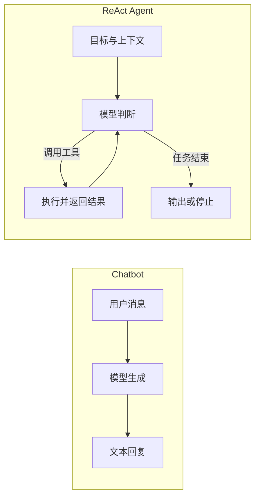
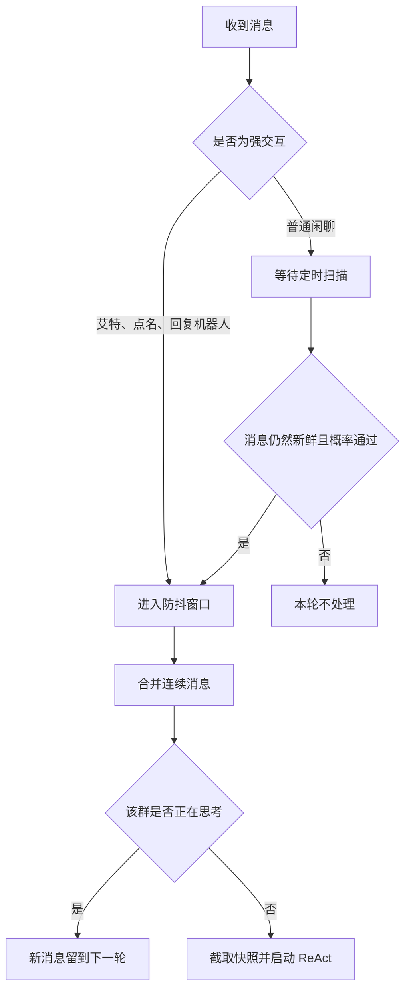
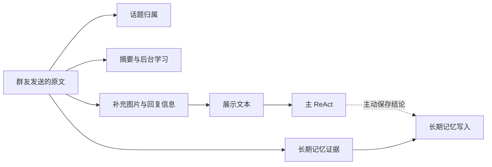
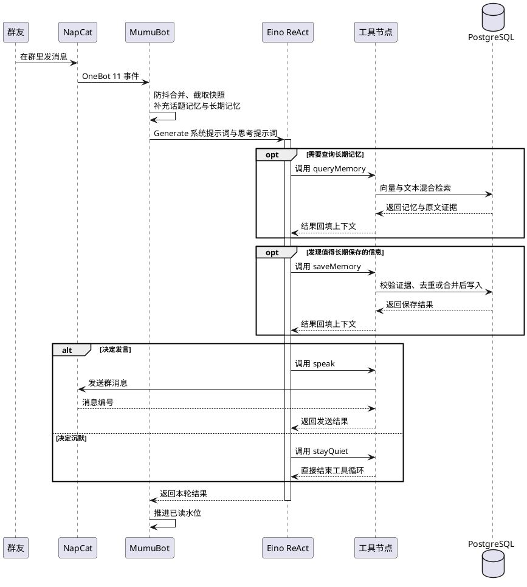
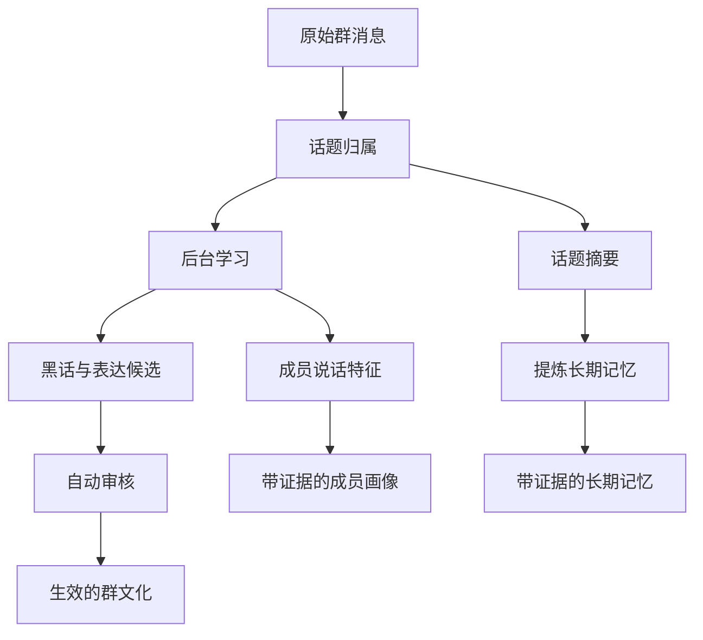
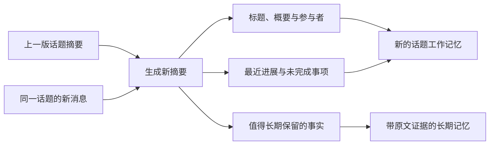
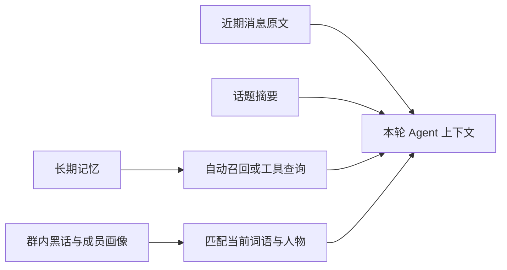
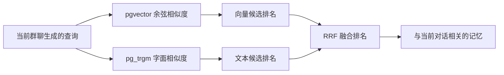

## 前言

2025 年中旬，"Agent 智能体"这个概念开始火遍全网，当大模型有了手和脚，不再局限于一来一回的文字对话，而是成为了可以自主行动、真正替你完成任务的智能体时，各种应用场景开始涌现。彼时我便有一个想法：如果给智能体提供相关工具，直接放到 QQ 群聊环境中，它能否有足够的思考和沟通能力，成为一个真正的赛博群友？

其实在 25 年初的时候，我就刷到过一个叫做 MaiBot 的同类项目，它的表现很不错，但是它的主链路并没有真正交给模型，回复、规划和记忆提取都依赖于多个单次模型调用和提示词串联，下一步做什么仍然由程序提前安排（叠甲：至少 25 年末的时候是这样的），并且它的体量过于庞大，设计复杂。而我想尝试的是另一条路：把群聊上下文和一组工具直接交给同一个模型，让模型自己决定下一步该做什么。

于是，MumuBot 诞生了，鉴于我对 Go 语言比较熟悉，并且其简约风格和单个二进制产物的特性很符合我的喜好，自然就选择了 Go 语言来实现。Agent 相关的开发框架使用了字节跳动开源的 Eino，功能丰富、文档齐全，并且官方支持也很活跃，再适合不过了。

在经过一段时间的开发和迭代后，沐沐终于趋于完善了，能够在群里和大家谈笑风生、插科打诨。作为本人的第一个 Agent 项目，自然要写篇博客好好记录下。



## 何为 Agent

要说明这条路有什么不同，得先回到 ChatBot 的工作方式。2022 年，ChatGPT 横空出世，它就是典型的 AI ChatBot：用户发来消息，后端把上下文交给模型，模型回答一段文本。

Agent 与 ChatBot 的最大区别就在于模型不只负责回答问题，还能围绕目标自主决定下一步行动。工具调用是 Agent 做出行动的常见方式，但这些行动具体如何组织，并没有一套固定答案。ReAct 就是其中最为常见的一种范式，也是 MumuBot 采用的方式。

ReAct 即 Reasoning and Acting，意为推理和行动交替进行。在这套范式里，后端预先给大模型提供一些工具函数，并将它们的调用方法注入模型上下文。模型根据情景选择合适的工具，输出结构化的 JSON 调用指令；后端执行对应工具，再把结果追加到上下文中，让模型继续生成。这个过程不断循环，直到模型给出最终结果或主动停止。



图里多出的这条回路，就是 ReAct 最核心的部分。无论是生成回复、检索记忆还是持久化存储，都是模型可以选择的动作；工具返回结果后，模型仍然可以根据新的信息继续进行决策。

MumuBot 没有自己实现这段循环，而是直接用了 Eino 提供的 `react.NewAgent`。

```go
agent, err := react.NewAgent(a.ctx, &react.AgentConfig{
    ToolCallingModel: a.model,
    ToolsConfig: compose.ToolsNodeConfig{
        Tools:               a.tools,
        ExecuteSequentially: true,
    },
    MaxStep: maxStep,
    ToolReturnDirectly: map[string]struct{}{
        "stayQuiet": {},
    },
})
```

模型一次可以给出多个工具调用，`ExecuteSequentially` 限制了工具节点按顺序执行，避免多个带副作用的动作同时提交到 QQ。循环步数也有上限，当模型抽风不断循环时，撞到 `MaxStep` 限制后就会自动终止。

既然开口是一种行动，沉默也应该有明确的终点：`stayQuiet` 工具被设成了直接返回。当一批调用中包含它时，工具执行完便直接结束本轮，不再回到下一次模型判断。

省略统计回调、调试日志和错误处理后，MumuBot 中的调用代码只剩下下面几行：

```go
msgs := []*schema.Message{
    schema.SystemMessage(systemPrompt),
    schema.UserMessage(thinkPrompt),
}

ctxWithTimeout, cancel := context.WithTimeout(ctx, agentThinkTimeout)
defer cancel()

result, err := a.react.Generate(ctxWithTimeout, msgs)
```

外层只调用一次 `Generate`，循环、工具结果回填和步数控制都由 Eino 内部自动完成。

## 沉默是金，雄辩是银

ReAct 解决的是 Agent 启动以后怎么行动，但 QQ 群里的消息不会像聊天窗口那样，一问一答地等着机器人。几十个人随时都在说话，沐沐首先得判断什么时候该开始这一轮思考。

最暴力的做法是每收到一条消息就运行一次模型，可群里一天能刷出成百上千条消息，大部分内容和机器人无关。逐条判断不仅浪费调用费用，群聊稍微热闹一点，机器人就会频繁刷屏。反过来，如果只做定时检查，被群友@以后不能马上思考回消息，反应又会慢半拍。

所以 MumuBot 保留了两条触发路径。被@、被点名或者被回复时，消息会直接进入待处理队列；普通闲聊则交给定时任务扫描。为了避免群友连续发言时在第一句话就立马触发思考，消息最后还会进入防抖窗口，把群友连续发出的几句话合在一起。



同一个群一次只运行一轮思考。运行期间的新消息照常入库，但不会再重新启动 ReAct，而是等到下一轮再处理。程序只负责判断这段对话值不值得启动模型，至于具体需不需要发言或做其他动作，仍然由模型决定。没什么可说时，调用前面提到的 `stayQuiet` 就行。

## 一个函数，怎样成为工具

ReAct 通过工具和群聊环境交互。模型不会读取 Go 函数里的具体实现，而是根据工具名称、用途说明和参数结构来决定是否调用。因此，工具定义需要把负责的事情、调用时机和参数用途写清楚。

MumuBot 使用 Eino 的 `InferTool`，直接从 Go 结构体生成参数约束。下面是适当简化后的 `speak` 工具声明：

```go
type SpeakInput struct {
    Content  string  `json:"content" jsonschema:"description=你想说的话，不要用 markdown"`
    ReplyTo  int64   `json:"reply_to,omitempty" jsonschema:"description=要回复的消息 ID"`
    Mentions []int64 `json:"mentions,omitempty" jsonschema:"description=要艾特的用户 QQ 号"`
}

func NewSpeakTool() (tool.InvokableTool, error) {
    return utils.InferTool(
        "speak",
        "在群里说话。只有真的想说什么时才使用。每次只能发送一条消息，不要把多句话合在一起；如果要说多句话，请多次调用。",
        speakFunc,
    )
}
```

模型只需要决定发言内容、回复目标和要艾特的人。群号、机器人 QQ 号都是程序已经知道的运行时信息，直接通过 Go 的 `context` 注入工具即可，没必要再让模型填写。参数越少，工具之间的职责越清楚，模型调用时就越不容易犯迷糊。

`speak` 只是其中最常用的一个。现在 MumuBot 的主 ReAct 一共注册了 19 个内置工具，基本覆盖了群聊里常见的动作：

| 用途 | 工具 | 能做什么 |
| --- | --- | --- |
| 发言与互动 | `speak`、`stayQuiet`、`poke`、`reactToMessage`、`recallMessage`、`searchStickers`、`sendSticker` | 发消息、沉默、戳一戳、贴表情、撤回消息和发送表情包 |
| 补充群聊现场 | `getRecentMessages`、`getGroupMemberDetail`、`getGroupNotices`、`getEssenceMessages`、`getMessageReactions`、`getForwardMessageDetail` | 查看更早的聊天、成员资料、群公告、精华消息、表情回应和合并转发 |
| 记忆与群内文化 | `saveMemory`、`queryMemory`、`searchJargon`、`searchExpressions`、`updateMood` | 保存和查询长期记忆，理解群内黑话、说话习惯并调整情绪状态 |
| 外部信息 | `request_get` | 读取网页内容 |

除此之外，程序还可以通过 MCP 接入额外工具。MCP 是一套把外部工具统一提供给模型的协议，接入以后和上面这些内置工具没有太大区别，都会出现在 ReAct 可以选择的工具列表里。

这些工具并不是照着 QQ 接口一股脑全塞进去的。以表情包为例，`searchStickers` 只负责找出合适的候选，模型看完结果后，再决定要不要调用 `sendSticker`。查询和发送拆开以后，搜索不会顺带产生群聊动作，模型也有机会根据结果重新选择。查询记忆和发言也是同样的关系，先补信息，再决定接下来做什么。

会改变群聊状态的工具还得处理好执行结果。函数返回了，不代表消息真的发到了群里。`speak` 会等到 QQ 返回消息编号，确认成功后才把本轮标记为已经行动过：

```go
msgID, err := tc.SpeakCallback(ctx, tc.GroupID, input.Content, input.ReplyTo, input.Mentions)
if err != nil {
    return &SpeakOutput{Success: false, Message: err.Error()}, nil
}
tc.MarkActed()
return &SpeakOutput{Success: true, MessageID: msgID}, nil
// 校验与格式细节从略
```

发送失败时，工具会返回 `success: false` 和具体原因，同时把 Go 错误留空。直接抛出 Go 错误时，当前这次 `Generate` 会立刻结束，模型看不到工具返回的具体原因。没有触发 Go 层错误时，Eino 才会把这个失败结果交还给模型，让它决定修改参数、换个工具还是停下。

在使用 DeepSeek 系列模型时偶尔会出现一个问题：即使工具定义里明确表示参数是一个 Number，模型也可能生成字符串形式的数字，导致 Eino 解析失败。解决方法是写一个 `ToolArgumentsHandler` 并注册到 Eino 中，将字符串形式的数字和布尔值还原成正确类型。

```go
// 本段代码已省略校验、类型转换判断逻辑，仅保留类型转换部分
func coerceToolArgument(value any, parameterSchema *jsonschema.Schema) any {
	switch parameterSchema.Type {
	case "object":
		object, ok := value.(map[string]any)
		for name, fieldValue := range object {
			if fieldSchema, exists := parameterSchema.Properties.Get(name); exists {
				object[name] = coerceToolArgument(fieldValue, fieldSchema)
			}
		}
		return object
	case "array":
		items, ok := value.([]any)
		for i := range items {
			items[i] = coerceToolArgument(items[i], parameterSchema.Items)
		}
		return items
	}
	text, ok := value.(string)
	switch parameterSchema.Type {
	case "integer", "number":
		return json.Number(text)
	case "boolean":
		if strings.EqualFold(text, "true") {
			return true
		}
		if strings.EqualFold(text, "false") {
			return false
		}
	}
	return value
}
```

`coerceToolArgument` 是转换的核心代码，它会按照 Schema 递归处理对象和数组，把 `"123"` 转成数字、把 `"true"` 和 `"false"` 转成布尔值。

另一个很常见的问题是，某些模型有概率会连续执行多次完全相同的工具调用，导致重复访问数据库或在群内刷屏。解决方法也很简单，注册一个 `ToolMiddleware`，记住本轮已经成功执行的工具和参数，再遇到相同调用就直接跳过；返回 `success: false` 的调用不会记录，允许模型改完参数后重试。

## 看见该看见的

工具调用以后，结果还要回到上下文里，模型才能根据新信息继续判断。上下文里放什么、怎么排列、哪些内容应该被当作当前对话，都会影响模型下一步要不要查询、要不要发言。放得太少，模型接不上前面的聊天；放得太多，眼前正在发生的事情又会被旧消息淹没。因此 MumuBot 没有把数据库里的内容一股脑塞给模型，而是把群聊现场、历史消息、图片描述、话题记忆和长期记忆分开处理，不同内容有不同的作用和保存边界。

### 固定消息快照

工具可以让模型继续查询和行动，但同一轮里看到的群聊现场不能跟着变化。一次 ReAct 可能连续调用好几次模型和工具，这段时间群友依旧会继续发消息。如果每次调用工具以后都重新读取最新消息，模型连准备回复谁都可能变掉。

所以 MumuBot 会在思考开始时截取一份消息快照。聊天记录、话题工作记忆和话题检索都停在这个上界，之后收到的新消息继续入库，但不会混进当前这轮 ReAct。

渲染上下文时，快照会被拆成"旧消息"和"新消息"两部分，分段注入上下文中。旧消息仅供模型理解谈话背景，并通过提示词提醒模型不要单独回应；新消息才是这一轮要处理的对象。快照末尾同时也是已读水位，什么时候推进它，代码只有一行判断：

```go
func shouldCommitReadSnapshot(generateErr error, acted bool) bool {
    return generateErr == nil || acted
}
```

ReAct 正常结束时，已读水位自然向前推进。即使最后报错，只要前面已经执行过动作，也会推进水位，不然下一轮还会拿着同一段聊天重复操作。只有整轮失败并且什么都没做，水位才留在原处。

### 区分原文和展示文本

群聊里也不只有纯文本。图片需要经过视觉模型转为文字描述，回复消息还要带上被回复者和消息编号，这些信息能帮助 ReAct 理解现场，却不是群友原样说过的话。

数据库因此会同时保存原文和展示文本。展示文本服务于当前 ReAct，原文则交给话题归属、摘要和后台学习使用。这样即使图片描述有误，或者补充的回复关系不够准确，也不会直接污染后面的长期记忆。



### 利用前缀缓存

上下文如何排列，还会直接影响模型调用的费用。很多大模型服务商都提供前缀缓存功能，只要多次请求的开头完全相同，服务端就能复用已经算过的那部分数据。

想让它生效，就要把稳定内容放在前面，变化频繁的内容放在后面。人格、行为规则和工具定义通常不变；时间、群聊、话题摘要和召回记忆每轮都不同。

```go
// 系统提示词在 Persona 初始化时渲染一次，后续保持不变
systemPrompt := a.persona.GetSystemPrompt()

// 用户提示词每轮根据群聊现场重新构建
thinkPrompt := a.persona.GetThinkPrompt(promptCtx, chatContext, groupExtra, recentPeople)

msgs := []*schema.Message{
    schema.SystemMessage(systemPrompt),
    schema.UserMessage(thinkPrompt),
}
```

这样一轮变化的主要是后半段，前面的系统规则和工具说明就可以继续复用缓存。

总结一下，一条消息从进群到发出去，大致会经过下面这条路：



## 学习得以留下

最初 MumuBot 并没有独立的学习系统，更没有审核功能。保存记忆、记录黑话和更新成员印象都被做成了工具，主 ReAct 觉得有必要时就顺手调用。

这样写起来很省事，实际效果却不太稳定。模型的注意力是有限的，大部分都放在眼前的回复任务上，话说完了，记忆却忘了存。即使往提示词里补一句"记得学习"也没什么用，它偶尔照做，偶尔还是忘记，反而让每轮群聊又多背了一项任务。

实际运行时可以发现，聊天和学习的区别很明显。群聊要求马上理解现场并作出回应，学习则要稳定地扫过消息，不能指望模型每次都主动想起来。于是自动学习被拆出主 ReAct，放到后台单独运行。主 ReAct 依然可以主动查询和保存记忆，但不再负责给学习任务兜底。

这条后台链路也会调用模型，但没有使用 ReAct。群聊主链面对的是开放问题，下一步做什么要等模型看完工具结果以后再决定；话题归属、话题摘要、群文化提取、成员画像和记忆合并都有固定的处理顺序，模型只需要根据输入填出一份结构化结果。

这些任务在项目里统一封装成结构化 JSON 调用。调用方只关心提示词和结果类型，例如话题摘要可以写成：

```go
summary, err := llm.GenerateStructuredJSONObject[topicSummarySubmission](
    llm.WithTask(ctx, "topic_summary", modelName),
    model,
    prompt,
)
```

封装内部仍然调用 Eino 的 `chatModel.Generate`，但会先从 Go 结构体生成 JSON Schema，把 Schema 放进系统提示词，并把请求改为 `json_object` 模式，模型输出后再统一解析成目标类型。

消息入库以后，话题系统会先判断它属于哪段讨论。归属完成后，原文分别交给后台学习和话题摘要。后台学习负责提取群内黑话、表达习惯和成员特征；话题摘要负责更新当前讨论的进展，再挑出值得长期保存的事实。黑话和表达方式会先进入候选区，审核通过后才能生效，成员特征和长期记忆则保留对应的原始消息证据。



沿着后台学习这条路往下看，入口只有群文化和成员画像两个任务：

```go
func (l *Learner) processAllGroups() {
    for _, group := range config.Get().Groups {
        if !group.Enabled {
            continue
        }
        l.processCulture(group.GroupID)
        l.processMembers(group.GroupID)
    }
}
```

`processCulture` 从原文中提取黑话和表达方式，结果经过审核后写入群文化；`processMembers` 先读取已有画像，再根据新消息更新成员特征。两项工作都在后台完成，不会占用主 ReAct 的思考步骤。

另一条路负责话题摘要。它会结合上一版摘要和新消息，更新当前话题的进展，并从中提炼长期记忆：



无论是话题摘要提炼出的事实，还是主 ReAct 主动保存的内容，进入长期记忆时都不能只有一句模型总结，还得带上原始消息作为证据。程序会检查证据是否来自当前群、有没有被撤回、是否超出这次任务看到的消息范围。记录某位具体成员时，还会检查消息作者或者回复对象是否和这个人有关；群级记忆和机器人自身的记忆不做这一项人物匹配。

工具提交的记忆大致长这样：

```go
type RawMemoryClaim struct {
    SubjectUserID      *int64  `json:"subject_user_id"`
    Kind               string  `json:"kind"`
    Content            string  `json:"content"`
    EvidenceMessageIDs []int64 `json:"evidence_message_ids"`
}
```

`Content` 是准备保存的结论，`EvidenceMessageIDs` 则指向支撑这条结论的原始消息。写入前先做精确去重，如果没有完全相同的内容，再找出相似记忆交给模型判断是否合并。

到这里，群文化、成员画像、话题摘要和长期记忆都有了各自的存放位置。但模型不会记住两次调用之间发生过什么，下一轮思考时，这些内容还得重新放进上下文，或者由 ReAct 通过工具查回来。全部塞进去肯定不行，旧消息一多，眼前正在聊什么反而看不清楚。

刚刚发生的几句话需要保留原文，回复关系、语气和指代都藏在这些细节里。一个话题聊上几十条以后，继续重放全部消息就太占上下文了，压成摘要反而更容易看清讨论到哪一步。至于成员的偏好、经历和约束，隔上几天仍然可能用到，继续埋在聊天记录里迟早会被新的消息挤出去。

这三个需求自然分出了近期消息、话题工作记忆和长期记忆。时间跨度越长，保留的内容越精简。群内黑话和成员画像不按这条时间线展开，它们会在相关词语或人物出现时补进上下文，帮助模型理解这个群怎样说话、眼前的人大概是谁。



召回记忆时，MumuBot 会先按群、发言者和回复对象缩小范围，再同时进行向量检索和文本检索。向量一侧使用 pgvector 计算余弦相似度，擅长找到意思接近但写法不同的内容。文本检索通过 pg_trgm 的 `word_similarity` 匹配字面相近的内容，更容易命中昵称、缩写和版本号。

两边使用的分数不在同一个尺度上，直接相加没有什么意义。MumuBot 最后使用 RRF，也就是倒数排名融合，只看一条记忆分别排在两路结果的第几名，再按 `1 / (60 + 当前名次)` 累加得分。两边都靠前的记忆会自然排到前面，只在其中一路命中的内容也不会直接丢掉。



## 总结

核心模块的解析大概就这些，表情包系统、管理后台等无关紧要的功能就不多做赘述了，更多的细节可以参考项目源代码，或者阅读 [DeepWiki 文档](https://deepwiki.com/SugarMGP/MumuBot)。

想来还是很感慨，AI 能力的发展让很多曾经力所不能及的想法落地生根，如今只需要对原理、架构有基本的了解，就能交给 AI 去快速实现。倘若让我一行行手写、一点点调试，不知道要花多少时间才能有如今的完成度。

如今的沐沐虽然偶尔还是有点人机，离真人群友还有着不小的差距，不过看起来大家的反响还不错。作为一个玩具 Agent 项目，做到这里已经基本符合最初的设想了。

## 相关链接

- [ReAct：Synergizing Reasoning and Acting in Language Models](https://arxiv.org/abs/2210.03629)
- [Anthropic：Building effective agents](https://www.anthropic.com/engineering/building-effective-agents)
- [CloudWeGo Eino 用户文档](https://www.cloudwego.io/zh/docs/eino/)
- [OneBot 11 标准](https://github.com/botuniverse/onebot-11)
- [NapCatQQ 中文文档](https://napneko.github.io/)
- [RRF（Reciprocal Rank Fusion）排序融合](https://zhuanlan.zhihu.com/p/1914270914654237406)
- [pgvector 项目仓库](https://github.com/pgvector/pgvector)
- [pg_trgm — 使用三字母组匹配进行文本相似度支持](https://postgresql.ac.cn/docs/current/pgtrgm.html)
- [上下文硬盘缓存 | DeepSeek API Docs](https://api-docs.deepseek.com/zh-cn/guides/kv_cache)
- [MumuBot 项目仓库](https://github.com/SugarMGP/MumuBot)
